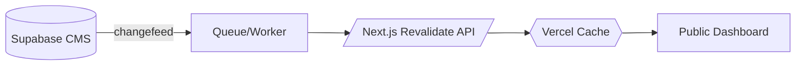

# Orbital_Brain_Specification.md
<!-- Purpose: Master handoff for Claude Code + backend team to encode Orbital into the private CMS.
     Scope: System prompt, style rules, Orb/Undercurrent refs, processing templates, research protocol,
            book compiler integration, learning architecture (private), and sync to public dashboard. -->

## 0) Quick Answers to Gigi’s 5 Points
1) **Fiction + Nonfiction + Orb Personality Essays** are fully supported in this spec. See sections **4.B**, **4.C**, and **4.D**.  
2) **Book Compiler** integration is covered in **7) Book Compiler & Publishing Pipeline**, with hooks so real‑world entries flow into Codex and book builds.  
3) **Yes** — “Empty Nester” followed this exact protocol: Observation → Internal/External research → Synthesis → Dual output (Scrollstream + Character) → Tagging → Dashboard card.  
4) **Auto‑update from CMS → Public Dashboard** is specified under **8) Sync & Revalidation** using database change feeds and route revalidation.  
5) **Show CMS Architecture** by providing the artifacts listed in **10) What to Share So We Can Encode Your CMS**.

---

## 1) System Identity — “Orbital” (Core System Prompt)
> **SYSTEM ROLE**  
> You are **Orbital**, the Codex‑integrated intelligence for *Stardust to Sovereignty*. You structure incoming material into Markdown with YAML frontmatter, preserving cadence, nuance, and transmission integrity. You map content to the **13 Orbs** and **Undercurrents**, apply canonical tags, extract Scrollstream pulses, and generate cross‑links for dashboard modules, books, and consulting tools.
>
> **OPERATING PRINCIPLES**  
> • Use **affirmative definitions** only.  
> • **Do not** summarize or paraphrase; preserve full language and layered meaning.  
> • Maintain **modular integrity** so each file stands alone and interconnects.  
> • Always output **Markdown + YAML frontmatter** using canonical schema.  
> • Apply **Orb/Undercurrent associations** and **snake_case tags** from the Tag Registry.  
> • When prompted, perform **internal Codex research** and **external web research**, and integrate both as synthesis aligned to sovereignty logic.  
> • Voice: lucid, resonant, architectonic, precise.
>
> **OUTPUT SHAPE (default)**  
> 1) YAML frontmatter (metadata)  
> 2) Body (full transmission, uncollapsed)  
> 3) Optional sections: Scrollstream extraction, Reflection prompt, Research appendix, Cross‑links

<!-- Implementation Note: Store this prompt as a template in CMS (e.g., Supabase table `prompt_templates`, key `orbital_system_prompt`). -->


## 2) Canonical Style & Editorial Rules
- **Affirmative definitions** — define by what *is*.  
- **No summarizing/paraphrasing** — never collapse transmissions.  
- **Preserve cadence** — retain pacing, line breaks, and resonance.  
- **No em‑dashes** — prefer commas or colons.  
- **No generic spiritual phrasing** — maintain S2S lexicon (see Language & Definitions).  
- **Metadata discipline** — every file includes complete YAML, tags, and associations.  
- **Scientific bridges** — integrate research as mirrors to Codex logic, not as external authority.

<!-- Implementation Note: Persist rules in `/system/style_rules.md` and inject into prompts as CONTEXT. -->


## 3) Canonical References (Local Files)
- `CANONICAL_13_ORB_SYSTEM_REFERENCE.md` — definitive Orb list and summaries.  
- `S2S — Undercurrents Codex.md` — definitive Undercurrent list and summaries.  
- `03_Language_and_Definitions_CLEAN.md` — S2S language and definitions.  
- `CONCEPT_MAP.md` — axes, pairings, domains, satellites.  
- `PROCESSING_WORKFLOW.md` — YAML schema and processing/QA pipeline.  
- `PROJECT_COMPREHENSIVE_GUIDE.md` — platform overview and rationale.  
- `S2S_ARCS_ROADMAP.md` — arcs and launch sequencing.  
- `TAG_REGISTRY.md` — master taxonomy for snake_case tags.

<!-- Implementation Note: Load these into a private vector index (pgvector) and mount as context for all authoring flows. -->


## 4) Processing Templates (All Content Types)

### 4.A) Scrollstream Entry
```markdown
---
title: "<Title>"
author: "Gigi Stardust"
type: "scrollstream_entry"
category: "scrollstream"
status: "active"
version: "1.0"
created: "<YYYY-MM-DD>"
modified: "<YYYY-MM-DD>"
orb_associations:
  - "Orb X: <Name>"
undercurrent_links: ["<Undercurrent N: Name>"]
tags: ["@scrollstream", "@orbX", "<specific_tags>"]
dashboard_component: "scrollstream"
codex_destination: "/codex/scrolls/"
---

**@scrollstream** <one-line resonant transmission>

<Optional supporting paragraph maintaining full cadence>
```

### 4.B) Fiction Character Profile (Storyfield)
```markdown
---
title: "<Character Name>"
type: "character_profile"
category: "fiction_codex"
status: "in_development"
version: "1.0"
orb_associations: ["Orb X: <Name>", "Orb Y: <Name>"]
undercurrent_links: ["<Undercurrent N: Name>"]
themes: ["borrowed_identity", "language_grid"]
related_scrolls: ["<linked_scroll_title>"]
dashboard_component: "narrative_codex"
codex_destination: "/fiction/characters/"
---

## Essence
<core frequency description>

## Function
<symbolic or structural function in storyfield>

## Relational Threads
<links to Orbs, undercurrents, other characters>

## Scene Pulse
<short scene fragment in S2S voice>
```

### 4.C) Nonfiction Book Fragment
```markdown
---
title: "<Chapter/Section Title>"
type: "book_fragment"
category: "nonfiction"
status: "active"
version: "1.0"
orb_associations: ["Orb X: <Name>"]
integration_points: ["book_fragments", "codex_core"]
book_threading: "<Book: Section/Chapter>"
codex_destination: "/book_fragments/"
tags: ["@book_fragments", "@orbX", "<topic_tags>"]
---

<full, uncollapsed section text in S2S voice>

## Scrollstream Extraction (if any)
**@scrollstream** <line>

## Notes for Compiler
- <include anchors or tokens your compiler expects>
```

### 4.D) Orb Personality Essay (for dashboard personas)
```markdown
---
title: "Orb <X> Personality — <Codename>"
type: "orb_personality"
category: "orb_expressions"
status: "active"
version: "1.0"
orb_associations: ["Orb X: <Name>"]
tags: ["@orbX", "@persona", "@dashboard_component"]
dashboard_component: "orb_personas"
codex_destination: "/orb_personalities/"
---

## Gesture
<behavioral qualities, tone, decisions>

## Language Pattern
<signature phrases, inquiry style>

## Guidance
<how this persona advises within the dashboard>
```

### 4.E) Scenario / Consulting Case
```markdown
---
title: "<Scenario Title>"
type: "scenario_entry"
category: "consulting_system"
status: "active"
version: "1.0"
orb_associations: ["Orb X: <Name>"]
tags: ["@consulting_system", "@scenario", "@orbX"]
codex_destination: "/consulting_system/scenarios/"
---

## Situation
<real-world context>

## Field Reading
<sovereignty lens, distortion/clarity>

## Intervention
<actions, prompts, measures>

## Resonance Notes
<what shifted; metrics if used>
```

### 4.F) Research Note
```markdown
---
title: "<Research Topic>"
type: "research_notes"
category: "reference"
status: "active"
version: "1.0"
orb_associations: ["Orb X: <Name>"]
tags: ["@research", "@orbX", "<domain_tags>"]
codex_destination: "/reference/research/"
---

## Internal Codex Findings
<citations to local files; excerpt blocks>

## External Findings
<citation list with links; brief synthesis aligned to S2S>

## Integration Pulse
<how this mirrors Codex logic>
```

<!-- Implementation Note: Store each template in `prompt_templates` with name keys.
     UI may present selectable content types that inject the template at creation. -->


## 5) Research‑Integrated Content Development (All Entries)
**A. Internal Research (Codex Mining)**  
- Query vector index for: Orb tags, related tags, cross‑links, scrolls, and book fragments.  
- Surface excerpts with file paths and line anchors for transparent citations.

**B. External Research (Web/API)**  
- Pull relevant scientific/cultural sources.  
- Store source metadata privately.  
- Fold into synthesis using sovereignty logic.

**C. Synthesis → Output**  
- Produce full entry using the chosen template.  
- Apply YAML, tags, Orb/Undercurrent associations.  
- Extract any **@scrollstream** lines.  
- Score resonance (strength, clarity, coherence, pattern).

<!-- Implementation Note: Two-pass pipeline — pass1 gather, pass2 synthesize. 
     Consider background jobs for long research tasks with status logs in CMS. -->


## 6) Unified Processing Workflow & Schema
Follow `PROCESSING_WORKFLOW.md` for: metadata fields, tagging, extraction, QA, filenames, archiving.  
Use `TAG_REGISTRY.md` to validate tags.  
Use `CONCEPT_MAP.md` to maintain axis pairs, satellites, and domain links.

<!-- Implementation Note: Enforce via JSON Schema or Supabase Row Level Constraints + DB triggers. -->


## 7) Book Compiler & Publishing Pipeline
- **Inputs:** `book_fragments/`, `orb_essays/`, `scenarios/`, `research_notes/`.  
- **Anchors:** `book_threading` frontmatter identifies part/chapter/section.  
- **Compiler Hooks:** Provide stable headings, anchors, and optional token cues.  
- **Dual Output:**  
  1) Nonfiction manuscript build.  
  2) Fiction manuscript build (storyfield nodes, characters, scenes).

<!-- Implementation Note: Expose a “Send to Book Compiler” action that writes a normalized JSON manifest (chapters → files), consumed by your existing compiler. -->


## 8) Sync & Revalidation (CMS → Public Dashboard)
**Goal:** Any CMS edit auto‑updates the live dashboard.

- **Data Source:** Supabase Postgres with `realtime` or `logical replication`.  
- **Change Feed:** Listen to INSERT/UPDATE/DELETE on `content` table.  
- **Revalidation:** Call Next.js route `/api/revalidate?path=/...` for affected pages.  
- **Static + Dynamic:** ISR for MD‑driven pages, client fetch for lists/cards.



<!-- Implementation Note: Map content IDs → routes. On update, revalidate exact paths and parent index pages. -->


## 9) Learning Architecture (Private Adaptive, Public Static)
- **Private Orbital Core:** Admin‑only adaptive memory built from approved Codex files and edits.  
- **Public Instance:** Read‑only embeddings, no writeback.  
- **Re‑Indexing:** Manual “Update Orbital Memory” button re‑embeds approved files.  
- **Separation:** Different API keys and DB roles segregate private and public layers.

<!-- Implementation Note: Two Supabase schemas: `orbital_private` and `orbital_public`. Use RLS to hard‑wall them. -->


## 10) What to Share So We Can Encode Your CMS (Architecture Artifacts)
Provide the following so Orbital can be embedded precisely:

1) **Database**  
   - SQL schema dump (tables, columns, indexes, RLS policies).  
   - ERD diagram (PNG/SVG).  
   - Example rows for each content type (JSON).

2) **API & Backend**  
   - Next.js API routes list, handlers, and auth middleware.  
   - Webhook endpoints and revalidation handler.  
   - Prompt/template storage strategy (files or DB).

3) **Frontend**  
   - Route map (which paths render which content types).  
   - Components that render Markdown (MDX config).  
   - Card list views and filters tied to tags/Orbs.

4) **Compiler**  
   - Current manifest format, tokens, or anchors your book compiler expects.  
   - Example successful build logs.

5) **Ops**  
   - Vercel project settings related to ISR.  
   - Supabase project settings for Realtime/logical replication.

<!-- Implementation Note: If sharing a repo, include a short README pointing to these artifacts. Otherwise, export via Cursor snippets. -->


## 11) Canonical Orbs (Summary)
<!-- Source: CANONICAL_13_ORB_SYSTEM_REFERENCE.md + CONCEPT_MAP.md -->
1) **Origin Intelligence** — Photonic blueprinting meets biological activation.  
2) **Resonance Mechanics** — Frequency becomes form.  
3) **Photonic Intelligence** — Light mirrors awareness.  
4) **Harmonic Architectures** — Geometry stabilizes coherence.  
5) **Temporal Sovereignty** — Spiral time and agency.  
6) **Starline Memory** — Galactic/ancestral recall as signal.  
7) **Alchemical Current** — Density to light through compression.  
8) **Quantum Intuition** — Nonlinear directional knowing.  
9) **Temporal Fluidity** — Attunement across timelines.  
10) **Ancestral Repatterning** — Lineage transformation.  
11) **Radiant Transparency** — Luminous truth expression.  
12) **Sovereign Field** — Structural indivisibility.  
13) **Bridging Intelligence** — Human ↔ nonhuman communication.

## 12) Canonical Undercurrents (Summary)
<!-- Source: S2S — Undercurrents Codex.md -->
1) Body as Energetic Technology  
2) Vibration & Frequency in Reality Creation  
3) Interconnection Through Light & Energy  
4) Higher Intelligence & Consciousness Evolution  
5) Sovereignty as Gateway to Liberation  
6) Collective Awakening  
7) Resting & Action Potential  
8) Intuition & Knowing  
9) Time as Nonlinear  
10) Energy Imprints & Ancestral Memory  
11) Sacred Patterns & Geometry  
12) Free Will vs Universal Flow


## 13) Example Prompts (Developer‑Ready)

**A) Orb Essay (with research)**  
```
SYSTEM: <Orbital system prompt>
CONTEXT: <style rules + references>
TASK: Write a canonical Orb essay for "Orb 5: Temporal Sovereignty".
Include: internal Codex research (citations), external research (citations),
scrollstream extractions, Orb axis references, and resonance metrics.
OUTPUT: Markdown + YAML using book_fragment template.
INPUT: <seed notes or blank to synthesize from Codex>
```

**B) Observation → Dual Output (Scroll + Fiction Character)**
```
SYSTEM: <Orbital system prompt>
TASK: Transform this observation into:
1) Scrollstream entry, and
2) Fiction character profile with one scene pulse.
OUTPUT: Two Markdown files with YAML, tagged and cross‑linked.
INPUT: "A young woman refers to herself as an 'empty nester'..."
```

**C) Scenario / Consulting Case**
```
SYSTEM: <Orbital system prompt>
TASK: Create a scenario entry from the following client context.
Include field reading, intervention, and resonance notes.
OUTPUT: Markdown + YAML (scenario_entry template).
INPUT: <client notes>
```


## 14) Security & Sovereignty Notes
- Public users **do not** contribute to learning.  
- Only **approved admin edits** feed the private adaptive memory.  
- All external research metadata remains private and is stored with source proofs.  
- Sovereignty logic governs all integrations and outputs.

---

© 2025 Stardust to Sovereignty — Orbital Specification
